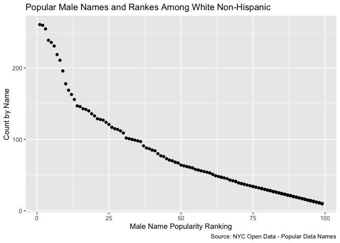

p8105\_hw2\_dna2118
================
Dionna Attinson
9/30/2019

## Question 1

### First we will clean the data Mr. Trash Wheel Data

``` r
Healthy_Harbor = 
  readxl::read_excel("./data/Trash-Wheel-Collection-Totals-8-6-19.xlsx",
  sheet = "Mr. Trash Wheel") %>% 
  janitor::clean_names() %>% 
  select(-x15, -x16, -x17) %>% 
  drop_na(dumpster) %>% 
  mutate(
    sports_balls = 
    as.integer(round(sports_balls, digit = 0)))
```

    ## New names:
    ## * `` -> ...15
    ## * `` -> ...16
    ## * `` -> ...17

### Now, we will read and clean the 2017 precipitation data

``` r
Precip2017 = 
  readxl::read_excel("./data/Trash-Wheel-Collection-Totals-8-6-19.xlsx",
  sheet = "2017 Precipitation",  
  range = "A2:B14") %>% 
  janitor::clean_names() %>% 
  drop_na(total) %>% 
  mutate(
    Year = 2017
  )
```

### Now, we will read and clean the 2018 precipitation data

``` r
Precip2018 = 
  readxl::read_excel("./data/Trash-Wheel-Collection-Totals-8-6-19.xlsx",
  sheet = "2018 Precipitation",
  range="A2:B14") %>% 
  janitor::clean_names() %>% 
  drop_na(total) %>% 
  mutate(
    Year = 2018
  )
```

### Now, we will combine the 2017 and 2018 precipitation datasets

``` r
Precip_Total = 
  full_join(Precip2017, Precip2018) %>% 
  janitor::clean_names() %>% 
  mutate(month=month.name[month])
```

    ## Joining, by = c("month", "total", "Year")

### Summarizing the Data

The total number of observations in the Healthy Harbor dataset is 344.
The number of observations in the joined 2017 and 2018 precipitation
data is 24. The total preciptation in 2018 was 70.33. The median number
of sports balls in a dumpster from 2017 8. Some key variables that were
present in both datasets include total, month and year.

## Question 2

### First, we will clean the data in pols-month

``` r
pols_month = 
  read_csv("./data/fivethirtyeight_datasets/pols-month.csv") %>% 
  janitor::clean_names() %>% 
  separate(mon, into = c("year", "month", "day"),
  convert = TRUE) %>% 
  mutate(month=month.name[month]) %>% 
  mutate(prez_dem=recode(prez_dem, "1" = "dem")) %>% 
  mutate(prez_gop=recode(prez_gop, "1" = "gop")) %>% 
  mutate(
    year = as.integer(year),
    month = as.integer(month),
    day = as.integer(day)) %>% 
  pivot_longer(c("prez_dem","prez_gop"),
    values_to = "president",
    values_drop_na = TRUE) %>% 
    select(-day)
```

    ## Parsed with column specification:
    ## cols(
    ##   mon = col_date(format = ""),
    ##   prez_gop = col_double(),
    ##   gov_gop = col_double(),
    ##   sen_gop = col_double(),
    ##   rep_gop = col_double(),
    ##   prez_dem = col_double(),
    ##   gov_dem = col_double(),
    ##   sen_dem = col_double(),
    ##   rep_dem = col_double()
    ## )

    ## Warning: Unreplaced values treated as NA as .x is not compatible. Please
    ## specify replacements exhaustively or supply .default
    
    ## Warning: Unreplaced values treated as NA as .x is not compatible. Please
    ## specify replacements exhaustively or supply .default

    ## Warning: NAs introduced by coercion

### Next, we cleaned the data in snp.csv

``` r
snp_data = 
  read_csv("./data/fivethirtyeight_datasets/snp.csv") %>% 
  janitor::clean_names() %>% 
  separate(date, into= c("month","day","year"),
  convert = TRUE) %>% 
  select(year, month, -day, close) %>% 
  mutate(month=month.name[month]) %>% 
  mutate(month = as.integer(month)) 
```

    ## Parsed with column specification:
    ## cols(
    ##   date = col_character(),
    ##   close = col_double()
    ## )

    ## Warning: NAs introduced by coercion

### We then tidied the unemployment data so that it can be merged with the previous data sets

``` r
unemployment_data = 
  read_csv("./data/fivethirtyeight_datasets/unemployment.csv") %>% 
  pivot_longer(
    Jan:Dec,
    names_to = "month", 
    values_to = "rate") %>% 
    mutate(month=match(month, month.abb)) %>% 
    mutate(month=month.name[month])  %>% 
    mutate(month = as.integer(month)) %>% 
    mutate(Year = as.integer(Year)) %>% 
    janitor::clean_names()
```

    ## Parsed with column specification:
    ## cols(
    ##   Year = col_double(),
    ##   Jan = col_double(),
    ##   Feb = col_double(),
    ##   Mar = col_double(),
    ##   Apr = col_double(),
    ##   May = col_double(),
    ##   Jun = col_double(),
    ##   Jul = col_double(),
    ##   Aug = col_double(),
    ##   Sep = col_double(),
    ##   Oct = col_double(),
    ##   Nov = col_double(),
    ##   Dec = col_double()
    ## )

    ## Warning: NAs introduced by coercion

### We then joined all three datasets

``` r
P2_joined_data = 
  pols_month %>% 
  left_join(snp_data, 
    by=c("year", "month")) %>%   
  left_join(unemployment_data,
    by=c("year", "month"))
```

### Summarizing the data

The data pols\_month contains 817 observations of 10 variables related
to the number of national politicians who are democratic or republican
at any given time.The years range from 1947 to 2015. The file
“unemployment” contains 816 observations of 4 variables that describe
the percentage of unemployment in each month of the associated year. The
years range from 1948 to 2015.The file snp contains 787 observations of
3 variables related to Standard & Poor’s stock market index (S\&P),
often used as a representative measure of stock market as a whole and
ranges from years 1950 - 2015. The key variables used are year and
month. In the joined data set, the years range from 1947 to 2015.

## Problem 3

### First, we will load and tidy the Baby Names data

``` r
Baby_names = 
  read_csv("./data/popular_baby_names.csv") %>%  
  janitor::clean_names() %>%
  mutate(ethnicity = recode(ethnicity, "ASIAN AND PACI" = "ASIAN AND PACIFIC ISLANDER")) %>% 
  mutate(ethnicity = recode(ethnicity, "WHITE NON HISP" = "WHITE NON HISPANIC")) %>% 
  mutate(ethnicity = recode(ethnicity, "BLACK NON HISP" = "BLACK NON HISPANIC"))  %>%  
  mutate(
    childs_first_name = str_to_title(childs_first_name),
    ethnicity = str_to_title(ethnicity), 
    gender = str_to_title(gender)) %>% 
  distinct () 
```

    ## Parsed with column specification:
    ## cols(
    ##   `Year of Birth` = col_double(),
    ##   Gender = col_character(),
    ##   Ethnicity = col_character(),
    ##   `Child's First Name` = col_character(),
    ##   Count = col_double(),
    ##   Rank = col_double()
    ## )

### Now, we will create a table showing the rank in popularity of the name “Olivia” as a female baby name over time and produce a similar table showing the most popular name among male children over time. Then, for male, white non-hispanic children born in 2016, we created a scatter plot showing the number of children with a name against the rank in popularity of that name

``` r
  Baby_names %>% 
    filter(childs_first_name == "Olivia", gender == "Female") %>% 
    select(everything(),-gender,-childs_first_name,-count) %>%  
    pivot_wider(
      names_from = year_of_birth, 
      values_from = rank) %>% 
  knitr::kable()
```

| ethnicity                  | 2016 | 2015 | 2014 | 2013 | 2012 | 2011 |
| :------------------------- | ---: | ---: | ---: | ---: | ---: | ---: |
| Asian And Pacific Islander |    1 |    1 |    1 |    3 |    3 |    4 |
| Black Non Hispanic         |    8 |    4 |    8 |    6 |    8 |   10 |
| Hispanic                   |   13 |   16 |   16 |   22 |   22 |   18 |
| White Non Hispanic         |    1 |    1 |    1 |    1 |    4 |    2 |

``` r
  Baby_names %>% 
    filter(gender == "Male", rank ==1) %>% 
    select(everything(),-gender,-rank,-count) %>% 
    pivot_wider(
      names_from = year_of_birth, 
      values_from = childs_first_name) %>% 
  knitr::kable()
```

| ethnicity                  | 2016   | 2015   | 2014   | 2013   | 2012   | 2011    |
| :------------------------- | :----- | :----- | :----- | :----- | :----- | :------ |
| Asian And Pacific Islander | Ethan  | Jayden | Jayden | Jayden | Ryan   | Ethan   |
| Black Non Hispanic         | Noah   | Noah   | Ethan  | Ethan  | Jayden | Jayden  |
| Hispanic                   | Liam   | Liam   | Liam   | Jayden | Jayden | Jayden  |
| White Non Hispanic         | Joseph | David  | Joseph | David  | Joseph | Michael |

``` r
Baby_names %>% 
  filter(gender == "Male", ethnicity == "White Non Hispanic", year_of_birth == 2016) %>% 
  ggplot(aes(x=rank, y=count)) + geom_point()+
  labs(
    title = "Popular Male Names and Rankes Among White Non-Hispanic",
    x = "Male Name Popularity Ranking",
    y = "Count by Name",
    caption = "Source: NYC Open Data - Popular Data Names"
  )
```

<!-- -->
